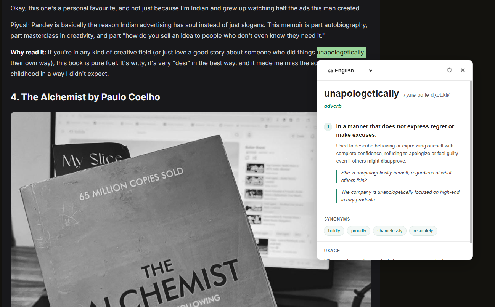
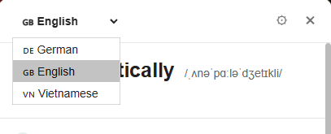
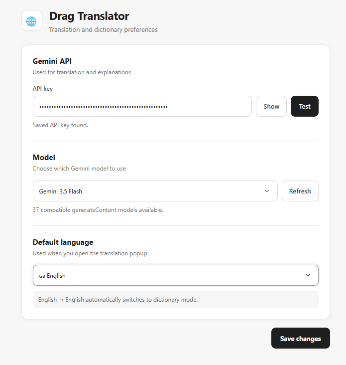

# Drag Translator

A lightweight browser extension that lets you **select text on any webpage and instantly translate or explain it using AI**.

Designed for quick reading, language learning, and contextual understanding without leaving the page.

---

## ✨ Features

* 🌐 Select text and translate it directly on the page
* 🇩🇪 German
* 🇬🇧 English
* 🇻🇳 Vietnamese
* 🧠 AI-powered translations and explanations
* 📖 English → English dictionary mode
* 🔤 Definitions, pronunciation, examples, synonyms, and usage notes
* ⚡ Floating translation button appears next to selected text
* 🎯 Context-aware translations for words, phrases, idioms, and sentences
* 🤖 Choose from available Gemini models
* 🔑 Built-in Gemini API key testing
* 💾 Remembers your preferred language and model
* ⚙️ Minimal settings page
* 🪶 Lightweight and easy to install as an unpacked Edge/Chrome extension

---

## Preview

You can add screenshots here to show how the extension works.

### Translation popup



### Dictionary mode



### Settings



---

## How It Works

1. Select text on a webpage.
2. A small 🌐 button appears next to the selection.
3. Click the button.
4. Choose your target language.
5. The selected text is sent to Gemini.
6. The result is displayed directly beside the selected text.

```text
Select text
     ↓
    🌐
     ↓
Choose language
     ↓
Gemini AI
     ↓
Translation / definition
```

---

## Dictionary Mode

When both the source text and target language are English, Drag Translator automatically switches to **dictionary mode**.

For example:

```text
self-belief
```

may return:

**self-belief**
/ˌself bɪˈliːf/

*noun*

**1.** Belief in your own abilities, qualities, and judgment.

> She developed greater self-belief after successfully completing the course.

**Synonyms**

`self-confidence` `confidence` `self-assurance`

**Usage**

Often used when talking about motivation, achievement, sport, education, and personal development.

This is especially useful for:

* unfamiliar words
* idioms
* expressions
* technical terms
* phrases
* nuanced English sentences

---

## Translation Mode

When the selected text and target language are different, the extension translates the text naturally instead of performing word-for-word translation.

Example:

```text
take something for granted
```

Target:

```text
Vietnamese
```

Result:

```text
coi điều gì đó là hiển nhiên
```

The AI can also include contextual meaning and examples when useful.

---

## Supported Languages

Currently:

| Language        | Code       |
| --------------- | ---------- |
| 🇩🇪 German     | German     |
| 🇬🇧 English    | English    |
| 🇻🇳 Vietnamese | Vietnamese |

More languages can easily be added later.

---

## Installation

### Microsoft Edge

1. Download or clone this repository.

2. Open Microsoft Edge.

3. Navigate to:

```text
edge://extensions
```

4. Enable **Developer mode**.

5. Click **Load unpacked**.

6. Select the project folder.

```text
drag-translator/
```

7. The extension should now appear in Edge.

---

## Configuration

Open the extension settings page.

You can configure:

* Gemini API key
* Gemini model
* default target language

### Gemini API Key

Enter your Gemini API key and click:

```text
Test
```

The extension checks whether the key is valid and loads compatible Gemini models.

Then choose a model and click:

```text
Save changes
```

---

## Gemini Models

Drag Translator does not rely on one hard-coded Gemini model.

Instead, it requests the models available to your API key and lets you choose one from the settings page.

Example:

```text
Gemini model

[ Gemini 3.5 Flash            ▼ ]

[ Refresh ]
```

This makes the extension easier to maintain when models are added, renamed, or retired.

---

## Project Structure

```text
drag-translator/
│
├── manifest.json
│
├── background.js
│
├── content.js
│
├── content.css
│
├── options.html
│
├── options.js
│
├── options.css
│
├── README.md
│
└── images/
    ├── translation-popup.png
    ├── dictionary-mode.png
    └── settings.png
```

### `manifest.json`

Defines the extension, permissions, background worker, content scripts, and settings page.

### `background.js`

Handles:

* Gemini API requests
* API key testing
* Gemini model discovery
* translation prompts
* dictionary prompts
* extension settings requests

### `content.js`

Handles:

* text selection
* floating translate button
* translation popup
* language switching
* dictionary result rendering
* popup positioning

### `content.css`

Controls the translation popup and dictionary interface.

### `options.html`

Settings page interface.

### `options.js`

Handles:

* API key configuration
* API key testing
* model loading
* model selection
* default language
* saved preferences

### `options.css`

Styles the settings page.

---

## Permissions

The extension currently uses:

```json
{
  "permissions": [
    "storage",
    "tabs"
  ]
}
```

It also needs access to the Gemini API:

```json
{
  "host_permissions": [
    "https://generativelanguage.googleapis.com/*"
  ]
}
```

---

## Privacy

Drag Translator sends only the text you choose to translate or explain to the configured Gemini API.

Your settings are stored locally using browser extension storage.

The Gemini API key is stored using:

```javascript
chrome.storage.local
```

For a personal unpacked extension, this is convenient.

However, browser extension storage should **not be treated as a secure secret vault**.

If you plan to publish the extension publicly, consider using your own backend instead of distributing a shared API key.

---

## Development

After changing extension files:

1. Open:

```text
edge://extensions
```

2. Find **Drag Translator**.

3. Click **Reload**.

4. Refresh the webpage where you are testing the extension.

This last step is important because an already-injected content script belongs to the previous extension context.

---

## Common Development Error

You may occasionally see:

```text
Extension context invalidated.
```

This usually happens after reloading the extension while a webpage containing the old content script is still open.

Simply refresh that webpage.

```text
Edit code
   ↓
Reload extension
   ↓
Refresh webpage
   ↓
Test again
```

---

## Roadmap

Possible future improvements:

* [ ] More target languages
* [ ] Automatic source-language indicator
* [ ] Pronunciation audio
* [ ] Copy translation button
* [ ] Keyboard shortcut
* [ ] Translation history
* [ ] Favorite words
* [ ] Vocabulary lists
* [ ] Dark mode
* [ ] Custom popup size
* [ ] Configurable AI prompts
* [ ] Alternative AI providers
* [ ] Per-language model preferences
* [ ] Export saved vocabulary
* [ ] Chrome Web Store / Edge Add-ons release

---

## Tech Stack

* JavaScript
* HTML
* CSS
* Browser Extensions Manifest V3
* Gemini API
* `chrome.storage.local`
* `chrome.runtime` messaging

---

## Browser Support

Primarily developed for:

* Microsoft Edge
* Google Chrome

Other Chromium-based browsers may also work.

---

## Contributing

Contributions and suggestions are welcome.

If you find a bug or have an idea for an improvement, feel free to open an issue or submit a pull request.

---

## Disclaimer

Translations and definitions are generated by AI and may occasionally be inaccurate.

For important academic, legal, medical, or professional terminology, verify the result with an authoritative source.

---

## License

Choose the license that fits your project.

For example:

```text
MIT License
```

---

## Drag. Understand. Keep Reading.

Drag Translator is designed around one simple idea:

> **Select text, understand it, and continue reading without leaving the page.**
